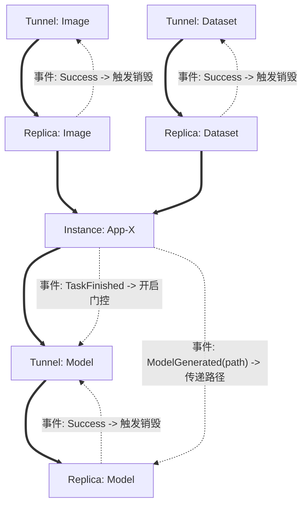

# DAG-EDA 编排引擎

本项目是一个结合了 **DAG (有向无环图)** 和 **EDA (事件驱动架构)** 的声明式资源编排引擎。它解决了传统 DAG 在处理异步信号、动态参数和资源生命周期清理时的不足。

## 核心理念：DAG + EDA

### 1. 节点与线 (Nodes & Edges)

*   **节点 (Node / Object)**：每个节点代表一个**资源对象 (api.Resource)**。它不仅仅是一个动作，而是一个维护自身期望状态（Expected State）的实体（如隧道、应用实例、数据副本）。
*   **线 (Edges)**：
    *   **实线 (DAG 拓扑依赖)**：定义了资源的启动顺序。只有父节点状态为 `Succeeded`，子节点才会被考虑启动。
    *   **虚线 (EDA 事件触发)**：定义了动态触发信号。通过事件总线传递，用于开启节点的**事件门控 (Event Gate)** 或触发资源的自动清理。

---

## 详细案例：跨数据中心部署与模型回收

### 业务场景
1.  将应用 **App X** 部署到 **DC1** 和 **DC2**。
2.  部署前需从 **DC3** 同步镜像，从 **DC4** 同步数据集。
3.  同步需要建立临时隧道，同步完成后自动删除隧道。
4.  App X 运行结束后，在 **DC1** 生成模型并回收至 **DC5**。

### DAG-EDA 逻辑图



### 关键机制说明
1.  **动态启动 (Event Gate)**：`T_Mod` 虽在 DAG 上依赖 `App`，但它会保持 `Blocked` 状态，直到接收到应用内部发出的 `TaskFinished` 异步事件。
2.  **用完即焚 (Reactive Cleanup)**：`R_Img` 拷贝成功后发布事件，触发上游 `T_Img` 的 `Deprovision`，实现自动清理。
3.  **参数透传 (Payload Binding)**：App 运行生成的模型路径通过事件负载传递给 `R_Mod`，实现了运行时的动态参数绑定。

## 运行 Demo
```bash
go run cmd/orchestrator/main.go
```
