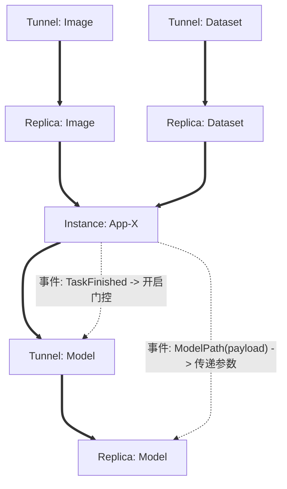

# DAG-EDA 编排引擎

本项目是一个结合了 **DAG (有向无环图)** 和 **EDA (事件驱动架构)** 的声明式资源编排引擎。它采用“内核-驱动”分离架构，实现了编排逻辑与具体业务的高度解耦。

## 1. 核心架构设计

### 引擎与驱动分离 (Core & Providers)
系统分为三个逻辑层级，确保了高扩展性和可维护性：

1.  **通用引擎层 (Core Engine)**：
    *   **职责**：负责拓扑排序（DAG）、并发调度、事件分发（EDA）和状态管理。
    *   **特点**：完全业务中立，不感知具体的资源类型（如 Tunnel 或 App）。
2.  **资源驱动层 (Providers)**：
    *   **职责**：实现具体的 `api.Resource` 接口。定义了资源的 `Provision`（创建）和 `Deprovision`（销毁）逻辑。
    *   **特点**：作为插件存在，可以根据业务需求自由扩展。
3.  **应用组装层 (Application/Demo)**：
    *   **职责**：通过**注册机制**将驱动注入引擎，并加载 JSON 声明文件启动工作流。

---

## 2. 目录结构说明

| 目录 | 功能说明 | 内容 |
| :--- | :--- | :--- |
| `pkg/api` | **协议定义** | 定义资源接口、事件模型、工作流配置 JSON 结构。 |
| `pkg/dag` | **拓扑引擎** | 维护资源间的静态依赖关系，生成执行层级。 |
| `pkg/eventbus` | **事件总线** | 核心 EDA 基础设施，支持实时广播和历史事件补发。 |
| `pkg/engine` | **编排核心** | 包含调度器（Orchestrator）、门控管理器（Gate）和资源工厂（Factory）。 |
| `pkg/providers` | **资源插件** | 具体的资源实现（如 Tunnel, Replica, Application）。 |
| `internal/demo` | **业务逻辑** | 演示场景的组装逻辑，包含资源注册和 Demo 运行函数。 |
| `cmd/` | **入口程序** | 编译后的可执行文件入口。 |

---

## 3. 核心理念：DAG + EDA 结合

*   **节点 (Object)**：每个节点是一个**资源对象**。它不仅是动作，而是维护自身期望状态的实体。
*   **线 (Edges)**：
    *   **实线 (DAG 拓扑线)**：定义**启动顺序**。父节点 `Succeeded` 后，子节点才可进入调度。
    *   **虚线 (EDA 事件线)**：定义**动态触发**。通过事件总线开启节点的“事件门控 (Event Gate)”，处理异步信号或动态参数透传。

### 案例流程图 (跨中心同步与模型回收)



---

## 4. 运行 Demo

### 模式 1：运行 JSON 驱动的声明式工作流 (推荐)
```bash
go run cmd/orchestrator/main.go demo-workflow.json
```

### 模式 2：运行硬编码的场景
```bash
go run cmd/orchestrator/main.go
```

## 5. 扩展新资源
1.  在 `pkg/providers` 下实现 `api.Resource` 接口。
2.  在启动时通过 `factory.Register("TypeName", CreatorFunc)` 注册。
3.  在 JSON 中即可使用该类型。
